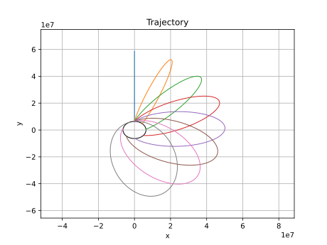

# Rocket Flight Simulator (v0.4)

Concurrent 2D rocket flight simulation of several rockets using a drag model, variable rocket conditions, and Euler integration.

---

## Example Run



---

## Features

- 2D vector-based motion and physics
- Drag model (including transonic drag divergence)
- Post-flight visualization of trajectory, altitude, drag, speed, and fuel
- Variable environmental conditions based on location of rocket
- Concurrent processing of different rockets on different cores
- Thrust-based propulsion model
- Fuel-limited engine burn
- Euler integration
- Asynchronous program logging

---

## Physics Assumptions

- 2D motion only
- Drag based on realistic constant calculations, not simulated fluid flow
- Atmospheric pressure determined by altitude and atmospheric layer alone
- Constant mass flow rate
- Instant throttle response
- Euler integration

---

## How to Run

```bash
python main.py
